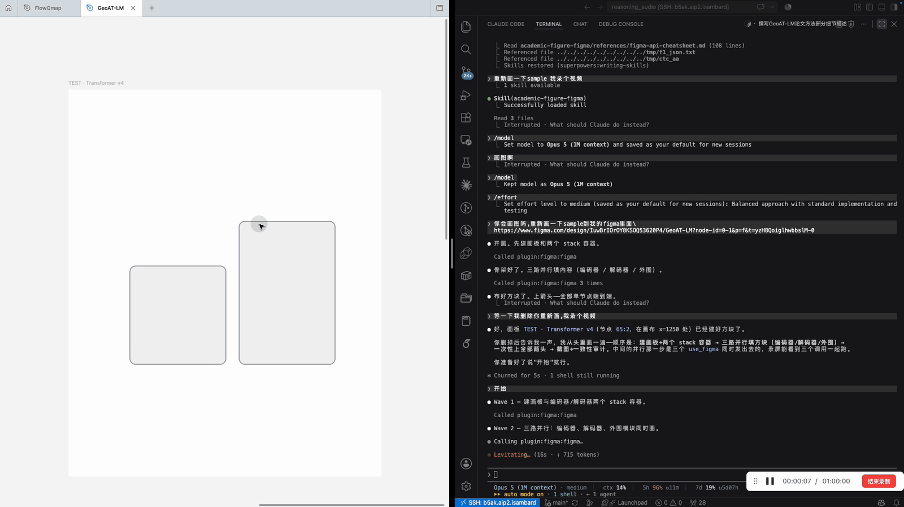

<p align="center">
  
</p>

<h1 align="center">Academic-Figure-Figma-CC-Skills</h1>

<p align="center"><b>学术绘图工具链的最后一公里。</b></p>

<p align="center">
  <a href="https://github.com/yushiran/Academic-Figure-Figma-CC-Skills/stargazers"></a>
  <a href="https://github.com/yushiran/Academic-Figure-Figma-CC-Skills/network/members"></a>
  
  
</p>

<p align="center"><a href="README.en.md">English</a> · 中文</p>

---

上游生图管线（[studio-pro](https://github.com/c-narcissus/paper-framework-figure-studio-pro)、[PaperBanana](https://github.com/llmsresearch/paperbanana)）产出栅格候选图，适合探索构图、无法手工微调。本技能让 **Claude Code 通过官方 Figma MCP 直接操作画布**，把候选图或草图落成**可编辑、论文精确尺寸的矢量成稿**：真实印刷宽度、真矢量图标、术语与论文源逐项对齐。

## 🎬 实况演示

<!-- VIDEO_EMBED_ZH -->
<p align="center">
  
</p>

<p align="center"><sub>左：Figma 画布实时成图 · 右：Claude Code 驱动绘制（6 倍速）· <a href="assets/demo.mp4">原速高清 mp4（2:31）</a></sub></p>

全程无人工干预：建骨架 → 三路并行填充 → 一次装配 25 根端到端箭头 → 截图自查，自查中发现两根 memory 线穿过了 cross-attention 方块并自行改线。

## ✅ 能力矩阵

| 能力 | 状态 |
| --- | --- |
| 栅格参考图复刻为可编辑矢量 | ✅ |
| 文字描述 / 草图生成框架图 | ✅ |
| 论文术语与数字预核验 | ✅ |
| IEEE / AAAI / NeurIPS / Elsevier 精确画布尺寸 | ✅ |
| LaTeX 公式矢量化 | ✅ |
| 图标缓存与逐个目检 | ✅ |
| 多路并行绘制 | ✅ |
| 样式一致性自动审计 | ✅ |
| 引导式 Figma MCP 配置 | ✅ |
| 结构化 figure lint（溢出/穿块/字号底线） | 🚧 规划中 |

## 📰 News

> - **2026-08** · v0.4：单节点端到端箭头、STYLE 令牌 + 一致性审计、latex2svg 公式管线、并行绘制协议、实况演示视频。
> - **2026-08** · v0.1 发布：五步工作流 + 五份 reference + iconfont 免登录搜索脚本。

## 📦 技能结构

```
academic-figure-figma/
├── SKILL.md          # 硬规则 + 五步工作流
├── references/       # 按需加载的细节文档
└── scripts/          # 可执行工具
```

| 文件 | 内容 |
| --- | --- |
| `SKILL.md` | 8 条硬规则；Preflight → 骨架 → 并行填充 → 装配 → 审图循环 |
| `references/figma-api-cheatsheet.md` | 自足 API 子集：单节点箭头、STYLE 令牌、一致性纪律、错误→修复表 |
| `references/parallel-drawing.md` | 并行绘制协议：同消息多路填充的安全条件与波次模式 |
| `references/figma-mcp-setup.md` | MCP 连接、远程会话 OAuth、席位/额度陷阱、教育版免费 200 次/天 |
| `references/paper-canvas-specs.md` | IEEEtran 252/516pt、elsarticle ≈390pt、AAAI 239/504pt、6pt 字号底线、Tinos 字体 |
| `references/figure-grammar.md` | 图语法契约：箭头双端证据、禁虚假中继、变量上线不占框、主线居中、反 AI 配色 |
| `references/icon-sourcing.md` | Lucide / lobe-icons / simpleicons / iconfont API 矢量获取与逐个核验 |
| `references/build-workflow.md` | 增量构建、多栏配平公式、截图自查清单、踩坑记录 |
| `scripts/figma_lib.js` | 实战沉淀的绘图库：单节点端到端箭头、stageColumn/chip/brace、auditConsistency |
| `scripts/latex2svg.py` | LaTeX → STIX（Times 风格）→ 可注入 SVG 的公式管线 |
| `scripts/iconfont_search.py` | iconfont.cn 免登录搜索 → 可注入 SVG |
| `scripts/assets/icons/` | 32 个预清洗图标缓存（24 Lucide + 8 AI 品牌标，逐个目检核验） |

## 🚀 快速开始

```bash
git clone https://github.com/yushiran/Academic-Figure-Figma-CC-Skills.git
cp -r Academic-Figure-Figma-CC-Skills/academic-figure-figma ~/.claude/skills/
claude plugin install figma@claude-plugins-official   # OAuth 步骤见 references/figma-mcp-setup.md
```

对 Claude Code 说：**「把这张框架图按 IEEE 双栏宽度在 Figma 里画出来」**。

## 🙏 致谢

[paper-framework-figure-studio-pro](https://github.com/c-narcissus/paper-framework-figure-studio-pro)（图语法规则提炼自其 S1/S4 prompt 契约）· [PaperBanana](https://github.com/llmsresearch/paperbanana) · [academic-figure-generator](https://github.com/LigphiDonk/academic-figure-generator) · Figma 官方 MCP 插件
